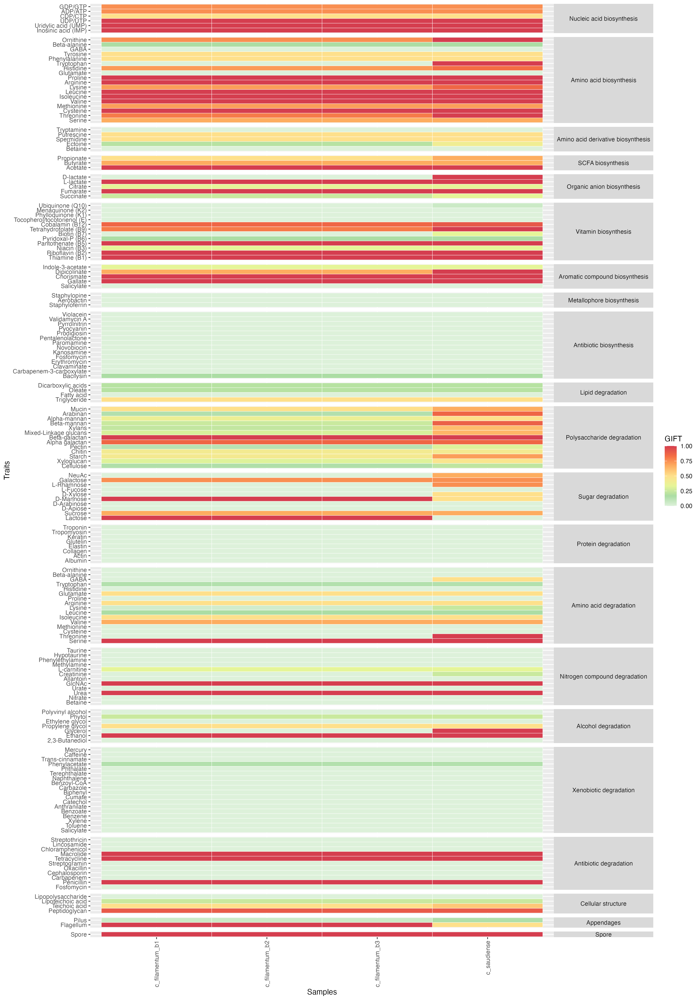
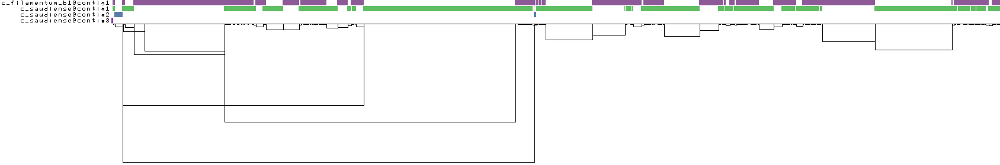

# Clostridium filamentum annotations and pangenomes

This repository contains the code to generate pangenomes of Clostridium filamentum and functionally annotate genes using multiple databases. Pangenome generation, gene calling and annotation are piped in snakemake (see snakefile).

## Genome annotation

Genome annotation is carried out individually for each genome using DRAM. The code below sends 4 jobs to the SLURM queue to run the script run_dram.sh for each of the four genomes.

```{sh}
sbatch run_dram.sh c_filamentum_b1
sbatch run_dram.sh c_filamentum_b2
sbatch run_dram.sh c_filamentum_b3
sbatch run_dram.sh c_saudiense
```

### Differences between filamentum and saudiense



### Differences among filamentum strains

| Gene | C_filamentum_b1 | C_filamentum_b2 | C_filamentum_b3 |
| --- | --- | --- | --- |
| K06283 - Stage III sporulation protein D [PF12116.10] | TRUE |  | TRUE |
| K04720 - Aminotransferase class I and II [PF00155.23] | TRUE |  | TRUE |
| K00196 - 4Fe-4S dicluster domain [PF13247.8]; 4Fe-4S dicluster domain [PF14697.8]; 4Fe-4S dicluster domain [PF13237.8]; 4Fe-4S dicluster domain [PF12838.9]; 4Fe-4S dicluster domain [PF13187.8]; 4Fe-4S binding domain [PF12797.9]; 4Fe-4S dicluster domain [PF13183.8] | TRUE |  | TRUE |
| K02897 - Ribosomal protein TL5, C-terminal domain [PF14693.8]; Ribosomal L25p family [PF01386.21] | TRUE |  | TRUE |
| K01567 - Polysaccharide deacetylase [PF01522.23] | TRUE | TRUE |  |

## Pangenome generation

### Internal pangenome (only filamentum)


### External pangenome (filamentum b1 + saudiense)



### Dependencies

- slurm
- miniconda
- dnakemake
- bifrost
- ggcaller
- bbmap
- dram

### Pipeline

Clone the repository.

```{sh}
git clone https://github.com/alberdilab/clostridium_filamentum.git
```

Create a screen session to run the snakemake pipeline and enter into the working directory

```{sh}
screen -S clostridium_filamentum
cd clostridium_filamentum
```

Load required modules to launch the pipeline if needed (common in HPC servers)

```{sh}
module purge && module load snakemake/7.20.0 mamba/1.3.1
```

Launch the snakemake pipeline.

```{sh}
snakemake -j 20 --cluster 'sbatch -o logs/{rule}.{wildcards.pangenome}-%j.out --mem {resources.mem_gb}G --time {resources.time} -c {threads} --job-name={rule}.{wildcards.pangenome} -v'   --use-conda --conda-frontend mamba --conda-prefix conda --latency-wait 600
```
